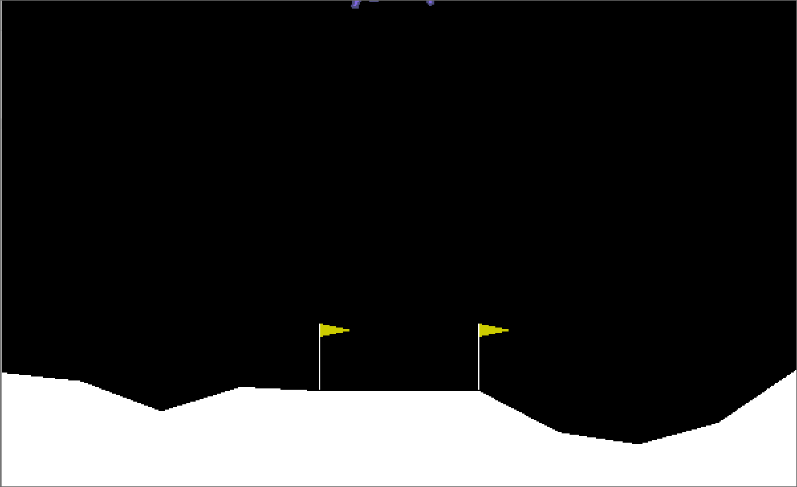

# Lunar Lander with Reinforcement Learning

This is a capstone project for the [reinforcement learning specialization by the University of Alberta](https://www.coursera.org/specializations/reinforcement-learning) which provides some of the utility code. The environment is provided by [OpenAI Gym](https://gym.openai.com/envs/LunarLander-v2/).

The design of the reinforcement system is in `RL_system.py`, and training is done in `RL_system_training.ipynb`.

This project trains a reinforcement learning agent to successfully land a 'lunar lander' without crashing. It uses a neural network as a function approximator to the action-values and selects actions according to a softmax policy. Training is done using Expected SARSA with the Adam optimizer. Experience replay is used to improve sample efficiency.

 

The above GIF is a recording from `RL_system_training.ipynb` of the RL agent running in the Lunar Lander Environment. It's able to reach it's goal, but can probably be improved if trained for longer!